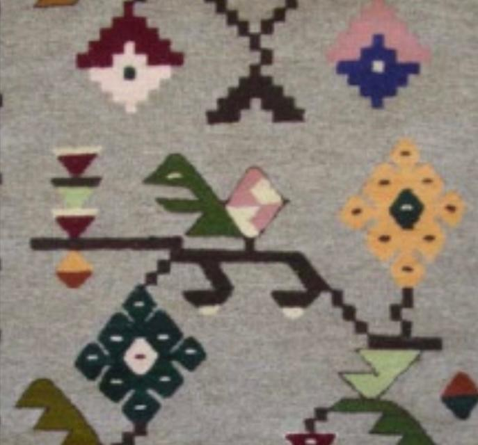

# Carpet

## Inspiration

## Idea

The challenge is to create a computer game based on the inspiration by the carpet fragment.

We will take the green creature in the middle as the main character.

The pink white thing is a basket.

The yellow diamonds can be collected one by one by touching them with the nose and go into the basket.

The green diamonds are storage. When the creature touches one of them with the nose, if there is space, the basket is emptied.

Create enemies from the upper left and upper right shapes. Make them alive by fliping their pattern on regular interval and make them move.

Use the background.

## Personal Challenges

Add 2-3 personal challenges.

They should be difficult from computing point of view and interesting from gamping point of view.
